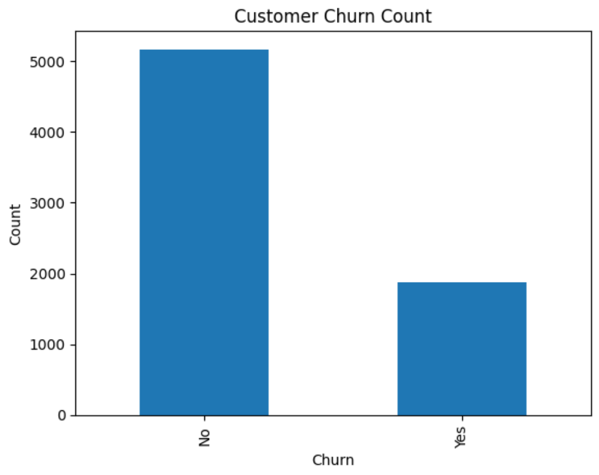

# Customer Churn Analysis

## Project Overview
This project analyzes customer churn data using Python and Pandas to understand customer behavior and identify churn patterns.

## Dataset
The dataset contains customer information such as:
- Customer ID
- Location (State, City)
- Charges
- Churn Label

## Tools Used
- Python
- Pandas

## Analysis Steps
- Data loading using pandas
- Data exploration (info, describe)
- Churn count analysis
- Churn percentage calculation

## Key Insights
- Percentage of customers who churned
- Basic statistical insights from the dataset

## Visualization


## How to Run
```bash
python analysis.py
